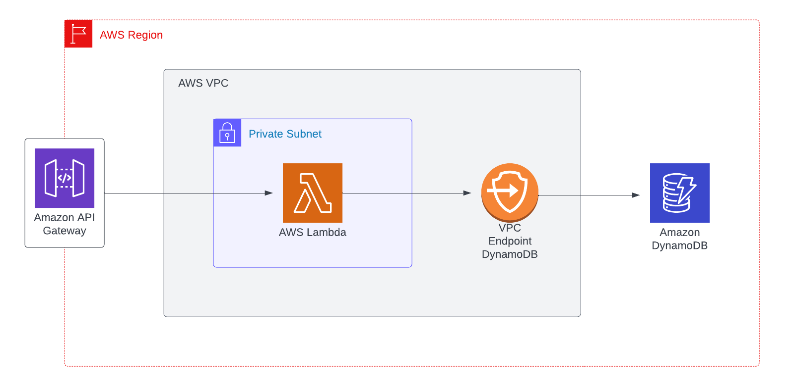

# AWS Lambda in Private Subnet connecting to DynamoDB with VPC Endpoint

CDK example of:

- AWS Lambda running inside a VPC
- Connecting with DynamoDB via VPC Endpoints and not via public internet
- VPC doesn't have NAT Gateways attached
- Completely isolated network running AWS Lambda code

Final architecture:

